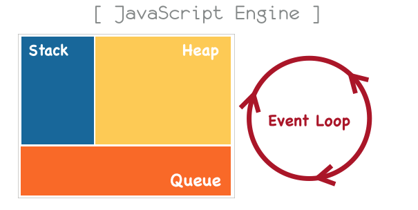
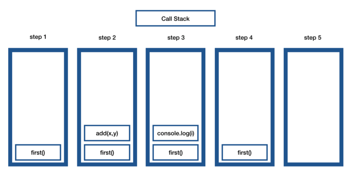
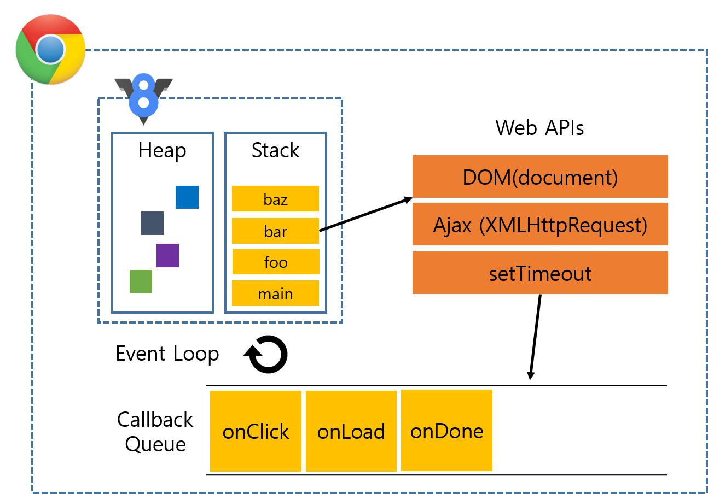
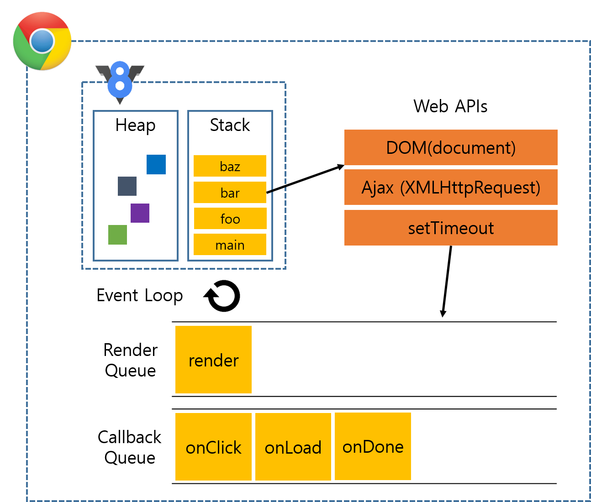

<!--
    BOARD_TITLE: 자바스크립트 엔진
    BOARD_DATE: 2021-11-21 13:28
    BOARD_TAG: ["엔진", "기초"]
-->
# 자바스크립트 엔진



## Call Stack
- 코드가 실행되면서 스택 프레임이 쌓이는 장소
- 하나의 호출스택을 사용, Run to Completion :  단 하나의 함수가 실행되면, 해당 함수의 실행이 끝날 때까지 다른 어떤 Task들도 수행될 수 없음을 의미.
        
```js
function add(x, y){
    return x+y;
}
function first(){
    var i = add(1,1); 
    console.log(i);
}
first();
```


        
    
## Heap
- 동적으로 생성된 객체(인스턴스)는 Heap 영역에 할당
- 동적 할당 변수는 컴파일러는 얼마나 많은 메모리를 필요로 할지 알수없음.
        
스택에 변수를 위한 공간을 할당할 수 없기 때문에, 동적 변수를 런타임 시점에 Heap 공간에 할당
        
## Task Queue(Evnet Queue)
    - 처리해야하는 Task들을 임시로 저장하는 대기 Queue
    - Task들은 Call Stack이 empty일때, 대기열에 들어온 순서대로 수행
    
    
    
    - 비동기로 호출되는 함수들은 Call Stack에 쌓이지 않고 Task Queue에 enQueue처리
    - 이벤트에 의해 실행되는 함수(핸들러)들이 비동기로 실행됨.
    - 자바스크립트 엔진이 아닌 Web Api영역에 정의되어 있는 함수들은 비동기로 실행된다.
    

## 런타임 동작 예제


## 렌더 큐



- 브라우저는 1초에 60프레임 속도로 화면을 다시 그립니다(Repaint).
- 하지만 자바스크립트가 하는 일들로 인해 Repaint 작업에 영향을 받습니다.
- 렌더도 큐에 쌓여 있는 하나의 콜백처럼 동작하기 때문에, 콜 스택에 코드가 있으면 렌더링 하지 못합니다.

- 느린 동기식 루프를 실행하면, 콜 스택에 코드가 쌓여있기 때문에 렌더가 동작하지 않습니다.
- 이벤트 루프를 막지 말라고 하는 것이 이러한 현상을 뜻합니다.
- 콜 스택에 쓸데없는 느린 코드를 쌓아서 브라우저가 할 일(렌더링)을 못 하게 하는 일이 없어야 합니다.
- 단위가 큰 코드는 작은 단위로 쪼개거나, 오래 걸리는 작업들은 비동기로 동작시키는 것이 좋습니다.